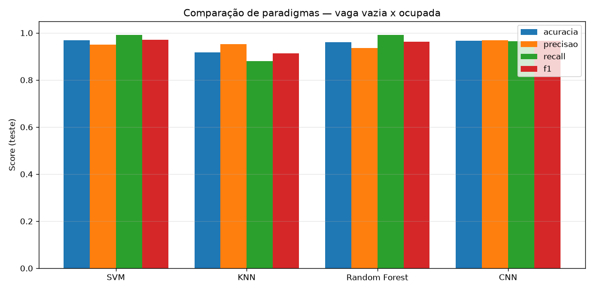
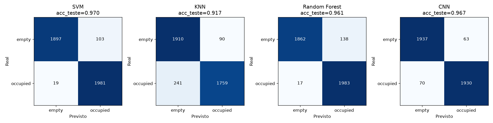
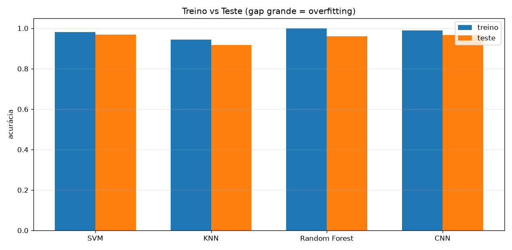
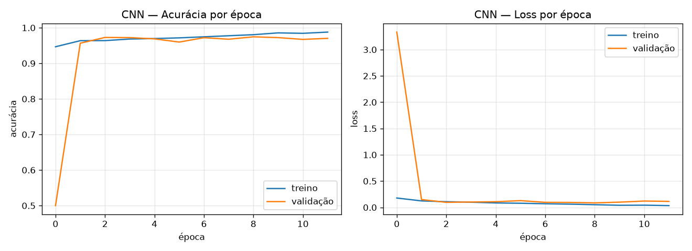
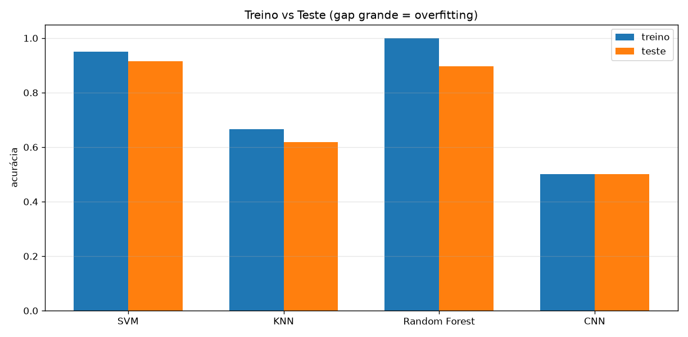

# Contador de Vagas de Estacionamento — Classificação e Benchmark de Paradigmas de ML

Projeto que detecta se uma vaga de estacionamento está **vazia** ou **ocupada** a
partir de imagens de câmeras de monitoramento, e conta quantas vagas livres/ocupadas
há em cada imagem. Usa o dataset **PKLot** (estacionamentos da UFPR e da PUC-PR).

Além da funcionalidade base (uma **CNN** que classifica cada vaga), o projeto foi
estendido com um **benchmark comparando paradigmas de Machine Learning** —
**SVM, KNN, Random Forest e CNN** — na mesma tarefa, com diagnóstico de
**overfitting / underfitting**.

---

## 1. Lógica do projeto

### Ideia base
Cada imagem de estacionamento vem acompanhada das **coordenadas de cada vaga**. O
pipeline de classificação por vaga é:

1. **Recortar** a região de cada vaga (bounding box da anotação).
2. **Redimensionar** o recorte para um tamanho fixo.
3. **Classificar** o recorte como `empty` (vazia) ou `occupied` (ocupada).
4. **Contar** quantas vagas de cada tipo existem na imagem.

### O incremento — benchmark de paradigmas
O mesmo problema de classificação é resolvido por **quatro paradigmas diferentes**,
todos treinados no **mesmo** conjunto de treino e avaliados no **mesmo** conjunto de
teste, para uma comparação justa:

| Modelo | Paradigma | Representação da imagem |
|---|---|---|
| **SVM** | Margem máxima (kernel) | RGB 15×15 achatado (675 features) |
| **KNN** | Baseado em instâncias | RGB 15×15 achatado |
| **Random Forest** | Ensemble de árvores | RGB 15×15 achatado |
| **CNN** | Rede neural profunda | RGB 32×32 (aprende as features) |

São reportadas **acurácia, precisão, recall e F1**, além de **matriz de confusão**,
**tempos de treino/inferência** e um **diagnóstico automático de
overfitting/underfitting** (comparando desempenho em treino, validação e teste).

---

## 2. Estrutura dos arquivos

**Base (classificação de vagas):**
- `train_cnn_model.py` — treina a CNN original.
- `create_model.py` — treina o SVM original.
- `parking_classifier.py` / `use_cnn_model.py` — inferência sobre imagens completas
  (aplica máscara, recorta, classifica e conta as vagas).
- `mask_creation.py` / `individual_masks.py` / `prepare_training_data.py` — utilitários
  de pré-processamento e preparação de dados.
- `masks/` — máscaras das vagas (PUCPR, UFPR04, UFPR05).

**Incremento (benchmark):**
- `extract_crops.py` — gera os recortes de vaga a partir do dataset PKLot (Pascal VOC).
- `benchmark.py` — treina e compara SVM, KNN, Random Forest e CNN.

> As pastas de dados (`PKLot/`, `crops/`) e de resultados (`benchmark_results/`) são
> geradas localmente e **não** vão para o Git (ver `.gitignore`).

---

## 3. Instalação

Requer **Python 3.10+**. Crie um ambiente virtual e instale as dependências:

```bash
python3 -m venv venv
# Linux/Mac:
source venv/bin/activate
# Windows:
venv\Scripts\activate

pip install --upgrade pip

# opção A — instalar as versões exatas testadas:
pip install -r requirements.txt

# opção B — instalar os pacotes principais diretamente:
pip install numpy opencv-python scikit-image scikit-learn matplotlib seaborn tqdm tensorflow
```

---

## 4. Baixar as imagens (dataset PKLot)

O dataset **não** está no repositório (é grande). Baixe pelo Roboflow:

1. Acesse: **https://public.roboflow.com/object-detection/pklot/2**
2. Clique em **Download** (canto superior direito).
3. Em **Format**, escolha **Pascal VOC** (na seção XML).
4. Em **Export Size**, use **640** (suficiente e mais leve).
5. Em **Download Options**, escolha **Download zip to computer** → **Continue**.

Você receberá um arquivo `.zip` (ex.: `PKLot.v2-640.voc.zip`).

### Onde colocar as imagens

Crie uma pasta chamada `PKLot/` na **raiz do projeto** e **descompacte o zip dentro
dela**, de modo que a estrutura final fique assim:

```
parking-lot-space-counter/
├── PKLot/
│   ├── train/   (imagens .jpg + anotações .xml)
│   ├── valid/
│   └── test/
├── extract_crops.py
├── benchmark.py
└── ...
```

Exemplo no terminal (Linux/Mac), a partir da raiz do projeto:

```bash
mkdir -p PKLot
unzip PKLot.v2-640.voc.zip -d PKLot
```

> **Importante:** o conteúdo precisa ficar em `PKLot/train`, `PKLot/valid` e
> `PKLot/test`. Se ao descompactar as pastas caírem soltas na raiz, mova-as para
> dentro de `PKLot/`.

---

## 5. Como executar

### Passo 1 — Gerar os recortes de vaga

Lê o PKLot, recorta cada vaga pela bounding box e organiza em
`crops/{train,valid,test}/{empty,occupied}/`:

```bash
python extract_crops.py --src PKLot --out crops --size 64 \
    --max-per-class train=8000 valid=2000 test=2000
```

- `--size 64` — tamanho (px) em que cada recorte é salvo.
- `--max-per-class` — quantos recortes **por classe** usar em cada conjunto
  (o dataset tem ~712 mil vagas; um subconjunto balanceado treina bem mais rápido).
  Omita este parâmetro para usar **todas** as vagas.

### Passo 2 — Rodar o benchmark

Treina SVM, KNN, Random Forest e CNN e gera as métricas e gráficos:

```bash
python benchmark.py --crops crops --out benchmark_results --cnn-epochs 12
```

**Variações úteis:**

```bash
# Somente a CNN (pula os modelos clássicos, mais rápido para iterar):
python benchmark.py --crops crops --skip-classical --cnn-epochs 12

# Demonstrar overfitting/underfitting com treino propositalmente pequeno:
python benchmark.py --crops crops --out benchmark_overfit_demo \
    --max-train-per-class 100 --cnn-epochs 30
```

### Saídas

Na pasta indicada por `--out` (padrão `benchmark_results/`):

- `results.csv` / `results.json` — métricas de todos os modelos.
- `metrics_comparison.png` — acurácia/precisão/recall/F1 por modelo.
- `confusion_matrices.png` — matriz de confusão de cada modelo.
- `train_vs_test.png` — acurácia treino vs teste (gap grande = overfitting).
- `cnn_learning_curve.png` — curvas de treino/validação da CNN por época.

O terminal também imprime uma tabela-resumo com o **diagnóstico**
(`ok` / `overfitting` / `underfitting`) de cada modelo.

---

## 6. Resultados

Comparação dos quatro paradigmas no conjunto de teste (treino com 16.000 recortes
balanceados). Todos foram treinados na **mesma** divisão treino/teste.

| Modelo | Acurácia | Precisão | Recall | F1 | Treino | Diagnóstico |
|---|---|---|---|---|---|---|
| **SVM** | 0.9695 | 0.9506 | 0.9905 | **0.9701** | 173 s | ✅ ok |
| **KNN** | 0.9173 | 0.9513 | 0.8795 | 0.9140 | ~0 s | ✅ ok |
| **Random Forest** | 0.9613 | 0.9349 | 0.9915 | 0.9624 | **18 s** | ✅ ok |
| **CNN** | 0.9670 | 0.9628 | 0.9715 | 0.9671 | 233 s | ✅ ok |





**Leitura dos resultados:**
- Todos os paradigmas passam de 91% — a tarefa vazia/ocupada é bem separável.
- **Random Forest** tem o melhor custo-benefício: F1 quase igual ao do SVM, mas
  treina ~10× mais rápido e faz inferência muito mais rápido.
- **CNN** tem o melhor equilíbrio precisão/recall e aprende as features sozinha,
  mas é a mais cara de treinar.
- **KNN** é o mais simples (treino instantâneo), porém o menos preciso.

### Diagnóstico de overfitting / underfitting

Comparando a acurácia de **treino vs teste**, um *gap* grande indica overfitting.
Com o treino completo (16.000), nenhum modelo apresenta overfitting relevante:



A curva de aprendizado da CNN confirma um treino saudável — treino e validação
sobem juntos e a *loss* de validação não dispara:



**O efeito do tamanho do treino.** Reduzindo o treino para apenas 200 imagens
(`--max-train-per-class 100`), o overfitting/underfitting aparece — a Random Forest
mantém 100% no treino mas despenca no teste (gap grande), enquanto KNN e CNN não
conseguem sequer aprender bem:



Ou seja: o volume de dados de treino é determinante para evitar overfitting.

---

## 7. Créditos do dataset

PKLot — Universidade Federal do Paraná (licença CC BY 4.0). Ao usar, cite:

> Almeida, P., Oliveira, L. S., Silva Jr, E., Britto Jr, A., Koerich, A.,
> *PKLot – A robust dataset for parking lot classification*,
> Expert Systems with Applications, 42(11):4937-4949, 2015.
